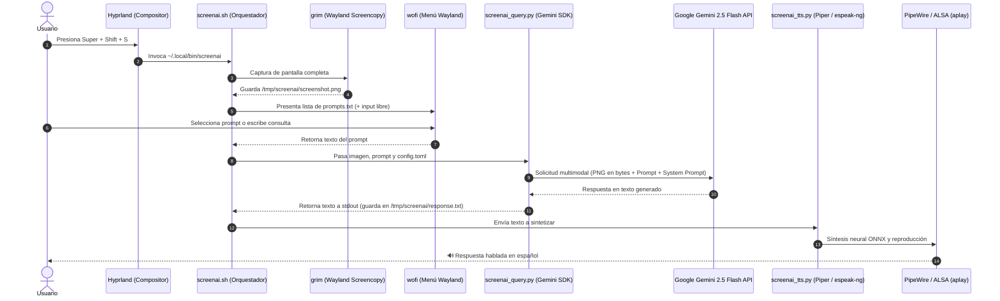

# Arquitectura del Sistema — ScreenAI

Este documento detalla la arquitectura técnica, flujo de datos y funcionamiento interno de **ScreenAI** en un entorno Arch Linux / Omarchy con Hyprland y Wayland.

---

## 1. Visión General y Flujo de Datos

ScreenAI es un asistente multimodal integrado a nivel de sistema de ventanas (Wayland). No requiere un servidor daemon pesado corriendo continuamente en segundo plano; se ejecuta por invocación bajo demanda mediante un script orquestador ligero disparado por Hyprland.



---

## 2. Diagrama de Bloques Funcionales

```mermaid
graph TD
    subgraph "1. Disparador & Entrada"
        A[Atajo de Teclado: Super+Shift+S] --> B[screenai.sh]
        B --> C[grim: Captura fullscreen silenciosa]
        B --> D[wofi: Selección de prompt o texto libre]
    end

    subgraph "2. Procesamiento de IA"
        C --> E[/tmp/screenai/screenshot.png]
        D --> F[Texto del Prompt]
        E --> G[screenai_query.py]
        F --> G
        H[~/.config/screenai/system_prompt.txt] --> G
        I[~/.config/screenai/config.toml] --> G
        G --> J[API Google Gemini 2.5 Flash]
        J --> K[/tmp/screenai/response.txt]
    end

    subgraph "3. Notificación y Salida de Voz"
        K --> L[notify-send: Preview visual en mako/dunst]
        K --> M[screenai_tts.py]
        N[~/.local/share/piper/voices/es_ES-*.onnx] --> M
        M -->|Principal: Piper Neural| O[PipeWire / aplay / paplay]
        M -->|Fallback: espeak-ng| P[espeak-ng]
        O --> Q[🔊 Altavoces / Auriculares]
        P --> Q
    end
```

---

## 3. Desglose de Capas y Protocolos

### Capa 1: Integración con el Compositor (Hyprland / Wayland)
- **Protocolo Wayland Screencopy:** `grim` se comunica directamente con el compositor Wayland mediante el protocolo `wlr-screencopy-unstable-v1` para volcar los buffers del framebuffer a un archivo PNG. Esto evita la necesidad de permisos de root o captura invasiva de X11.
- **Protocolo Wayland Layer Shell:** `wofi` utiliza el protocolo `wlr-layer-shell` para proyectarse por encima de cualquier ventana activa, tomando el foco de teclado de inmediato para una experiencia fluida.

### Capa 2: Inferencia Multimodal (Google Gemini)
- **Carga de Contexto:** `screenai_query.py` combina tres fuentes de información:
  1. **Imagen cruda:** Leída directamente en bytes y enviada en el payload mediante `types.Part.from_bytes`.
  2. **System Prompt:** Reglas de comportamiento (respuestas breves de 3 a 5 frases, sin preámbulos, formato legible para voz).
  3. **Prompt de Usuario:** La pregunta específica seleccionada o escrita en wofi.
- **Modelo:** Por defecto `gemini-2.5-flash`, optimizado para baja latencia (Time-to-First-Token) y análisis visual de alta fidelidad con costo mínimo.

### Capa 3: Síntesis de Voz (TTS) y Pipeline de Audio
- **Motor Primario (Piper TTS):** Utiliza modelos ONNX optimizados para arquitectura CPU (VITS architecture). Permite síntesis local ultra-rápida (tiempo real < 0.5x) sin enviar datos de audio a la red ni generar costos adicionales.
- **Mecanismo de Salida:** Se genera un archivo de audio PCM WAV en `/tmp/screenai/response.wav` que es transmitido al servidor de sonido del sistema (`pipewire` o `pulseaudio`) mediante utilidades nativas (`aplay`, `paplay` o `mpv`).
- **Resiliencia / Fallback:** Si piper o el modelo `.onnx` no están presentes, el script conmuta automáticamente a `espeak-ng`, garantizando que el usuario siempre reciba respuesta auditiva.

---

## 4. Gestión de Archivos Temporales y Ciclo de Vida

ScreenAI utiliza el directorio `/tmp/screenai` en memoria (`tmpfs`):

| Archivo | Propósito | Tiempo de Vida |
|---------|-----------|----------------|
| `/tmp/screenai/screenshot.png` | Buffer de la captura actual | Sobrescrito en cada ejecución |
| `/tmp/screenai/response.txt` | Respuesta completa devuelta por Gemini | Persiste hasta el siguiente query o reinicio |
| `/tmp/screenai/response.wav` | Audio generado por Piper | Sobrescrito en cada ejecución de voz |
| `/tmp/screenai/error.txt` | Salida de error estándar para diagnóstico | Sobrescrito en caso de error |

Al residir en `/tmp`, las capturas se limpian automáticamente al reiniciar el equipo, preservando la privacidad y evitando el desgaste del disco SSD.
